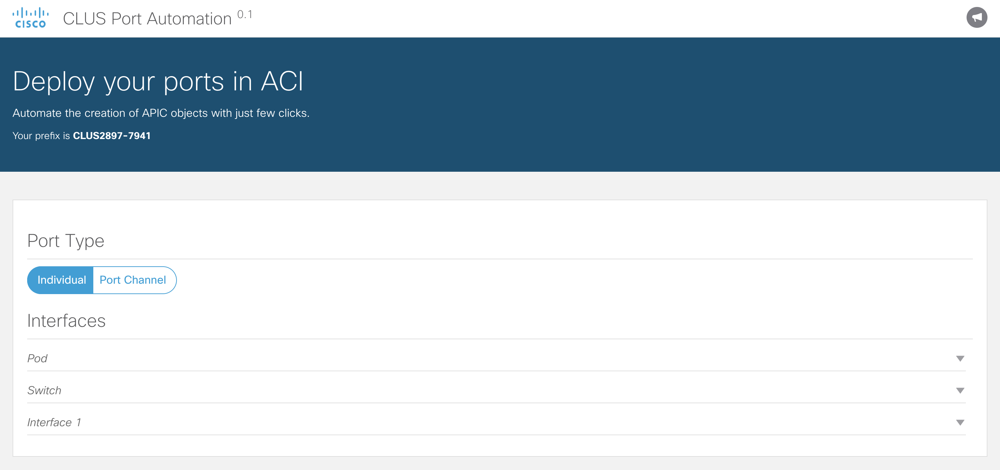

### Step 4 - Adding the port selection 

As we are implementing individual and port-channel scenarios, we have to include drop-down lists for the pods, 
the switches and the ports for the user to select.

The following code will create 4 selects (also known as drop-down list). We will be populating them with real data 
in a later step; for now, let's just focus on the HTML code. 

Copy the following code **below** the one added in step 3

```html
<div class="col-md-12 text-large">
    <br/>
    <h4>Interfaces</h4>
    <hr/>
    <!-- ****** Select for PODs ****** -->
    <div class="form-group">
        <div class="form-group__text select ">
            <select id="sel_pod" name="sel_pod" ng-model="deployment.selectedPod" 
            ng-options="pod as pod.fabricPod.attributes.dn for pod in pods track by pod.fabricPod.attributes.dn"
            ng-change="getSwitches(deployment.selectedPod)"></select>
            <label for="sel_pod">Pod</label>
        </div>
    </div>
    <!-- ****** Select for Switches ****** -->
    <div class="form-group">
        <div class="form-group__text select">
            <select id="sel_switch" ng-model="deployment.selectedSwitch"
            ng-options="switch as switch.fabricNode.attributes.name for switch in switches track by switch.fabricNode.attributes.dn"
            ng-change="getInterfaces(deployment.selectedSwitch)"></select>
            <label for="sel_switch">Switch</label>
        </div>
    </div>
    <!-- ****** Select for Interface 1 ****** -->
    <div class="form-group">
        <div class="form-group__text select">
            <select id="sel_port1" ng-model="deployment.selectedPort1"
            ng-options="interface as interface.l1PhysIf.attributes.id for interface in interfaces track by interface.l1PhysIf.attributes.dn"></select>
            <label for="sel_port1">Interface 1</label>
        </div>
    </div>
    <!-- ****** Select for Interface 2 ****** -->
    <div id="interface_2_selection">
        <div class="form-group">
            <div class="form-group__text select">
                <select id="sel_port2_pc" ng-model="deployment.selectedPort2"
                ng-options="interface as interface.l1PhysIf.attributes.id for interface in interfaces track by interface.l1PhysIf.attributes.dn"></select>
                <label for="sel_port2_pc">Interface 2</label>
            </div>
        </div>
    </div>
</div>
```

_Note: Use <kbd>option ⌥</kbd> + <kbd>command ⌘</kbd> + <kbd>L</kbd> to format the HTML file_

Refresh your browser to see the new section in the screen.



Next -> [Step 5 - Adding the EPG/VLAN options]

[Step 5 - Adding the EPG/VLAN options]: step5.md
